# Second Brain — Architecture & Codebase Walkthrough

> AI-powered life-decision simulator. You describe a major life decision (career,
> education, relocation…), and the system generates 6–8 realistic paths, researches
> each on the live web, runs financial Monte Carlo simulations, scores tradeoffs, and
> returns a ranked, evidence-backed set of scenarios.

This document explains **what the codebase actually does** and how the pieces fit
together, with diagrams generated from the source.

---

## 1. What it is, in one paragraph

A **React + TypeScript** single-page app talks to a **FastAPI** backend over a small
JSON/SSE API. The backend is organized as a pipeline of **LLM agents** (intake →
scenario generation → research → market outlook → tradeoff analysis → brief / what-if),
plus a pure-Python **Monte Carlo** engine. Agents call an OpenAI-compatible LLM
(**OpenAI** `gpt-4o-mini` by default), search the live web via **Tavily**, and
use **Qdrant** as a vector store to cut token usage via RAG. Every external dependency
**degrades gracefully** — the app (and its test suite) runs even with no API keys,
no Qdrant, and no network. Sessions are persisted as **JSON files** so a refresh or a
backend restart resumes where you left off.

---

## 2. System context

How the running pieces connect at deploy time.

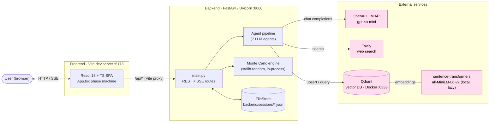

**Notes**

- The Vite dev server proxies `/api` → `http://localhost:8000` ([vite.config.ts](frontend/vite.config.ts)), so the SPA and API look same-origin to the browser. CORS is also opened for `http://localhost:5173` in [main.py](backend/app/main.py).
- Qdrant and the embedding model are **optional**: if either is missing, the retriever returns empty and callers fall back to raw search results. See [retriever.py](backend/app/tools/retriever.py).

---

## 3. The decision pipeline (backend `SessionState.phase`)

A session moves through five phases, driven by which endpoint the frontend calls.
The `phase` field on [SessionState](backend/app/state.py) is the source of truth and is
what session-resume keys off.

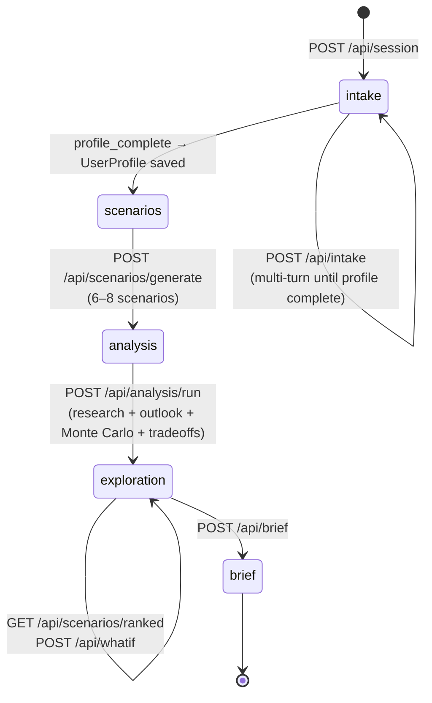

| Phase | Set by | Meaning |
|---|---|---|
| `intake` | session creation | Building the `UserProfile` via chat |
| `scenarios` | intake completes | Profile ready, awaiting scenario generation |
| `analysis` | scenarios generated | Scenarios exist, awaiting the heavy analysis run |
| `exploration` | analysis run completes | Results ready; ranking, what-if available |
| `brief` | brief generated | Final synthesized recommendation produced |

---

## 4. End-to-end request flow (with live progress over SSE)

The heaviest call is `POST /api/analysis/run` (2–4 minutes). To show live progress, the
frontend **opens an SSE stream first**, then kicks off the analysis; each agent step
pushes a message onto a per-session queue ([progress.py](backend/app/tools/progress.py))
that the SSE generator drains.

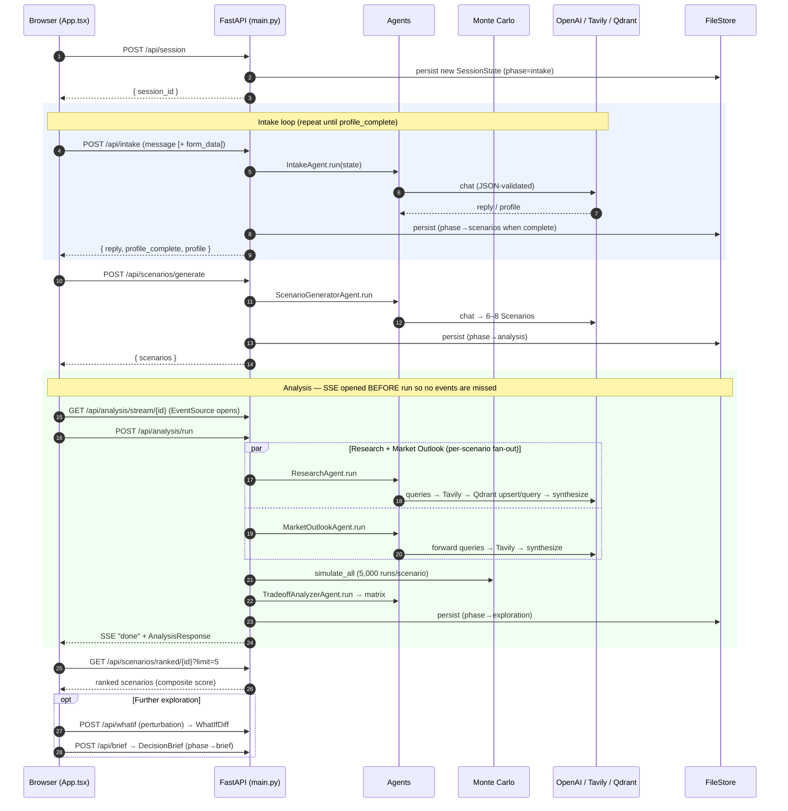

Every progress line you see in the UI (`[2/7] Searching the web for: …`) is an
`emit()` call from inside an agent landing on that session's SSE queue. A `None`
sentinel closes the stream (`done`), and errors emit an `{error: true}` event.

---

## 5. Inside `POST /api/analysis/run` — agent orchestration

This is the core of the system. Note the concurrency:

- **Task-level fan-out** via `asyncio.gather` (research ∥ market outlook; and within each,
  all scenarios in parallel). LLM calls in [llm.py](backend/app/llm.py) are issued directly
  with no client-side throttling; the OpenAI SDK's built-in retries (`max_retries`) handle
  the occasional transient 429/5xx.

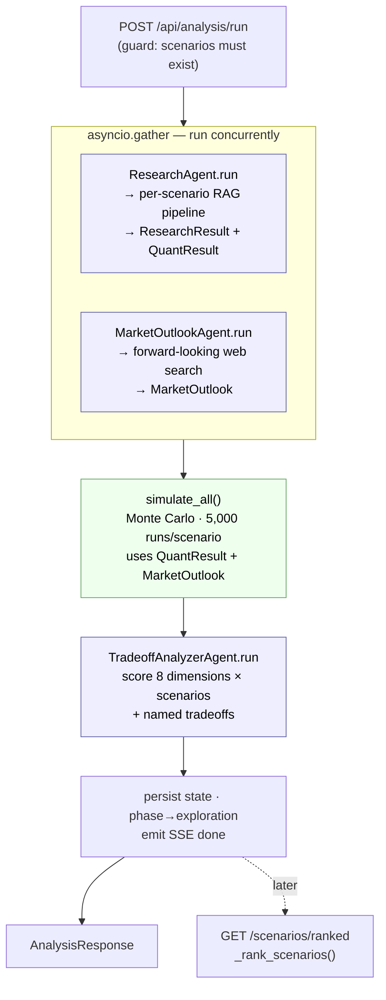

### Ranking formula (`_rank_scenarios` in [main.py](backend/app/main.py))

```
composite_score = tradeoff_score + monte_carlo_bonus

tradeoff_score   = Σ over the scenario's matrix entries of
                   { strong:3, mixed:2, weak:1, unclear:0 }

monte_carlo_bonus = prob_positive × 10
                  + { low:3, medium:1, high:0 }[risk_label]
```

Scenarios are sorted descending; `GET /api/scenarios/ranked/{id}?limit=N` returns the top N.

---

## 6. The agents

Every agent subclasses [`BaseAgent`](backend/app/agents/base.py) (`async run(state) -> AgentOutput`)
and is instantiated once as a singleton in `main.py`. All LLM output goes through
`chat_json_validated`, which enforces JSON mode + Pydantic validation **and retries once**
with the validation error fed back to the model.

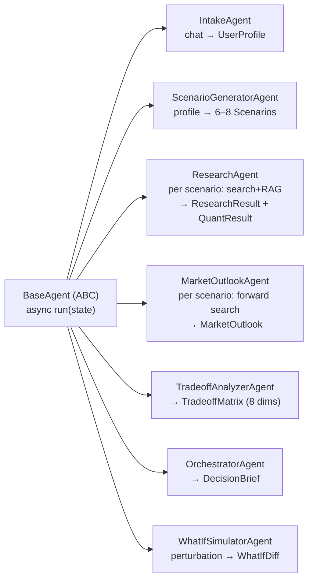

| Agent | Trigger | LLM calls (per scenario unless noted) | Output |
|---|---|---|---|
| **IntakeAgent** | `/api/intake` | 1 (whole conversation) | `reply`, `profile_complete`, `UserProfile` |
| **ScenarioGeneratorAgent** | `/api/scenarios/generate` | 1 (all scenarios) | `list[Scenario]` |
| **ResearchAgent** | `/api/analysis/run` | 3 (queries, qual synth, quant synth) | `ResearchResult` + `QuantResult` |
| **MarketOutlookAgent** | `/api/analysis/run` | 2 (queries, synthesis) | `MarketOutlook` |
| **TradeoffAnalyzerAgent** | `/api/analysis/run` | 1 (all scenarios, compact summary) | `TradeoffMatrix` |
| **OrchestratorAgent** | `/api/brief` | 1 (all) | `DecisionBrief` |
| **WhatIfSimulatorAgent** | `/api/whatif` | 1 (all) | `WhatIfDiff` (only what changes) |

---

## 7. ResearchAgent — the per-scenario RAG pipeline

This is the most involved agent and the main reason Qdrant exists. For **each** scenario
it runs the following; all scenarios run concurrently via `gather`.

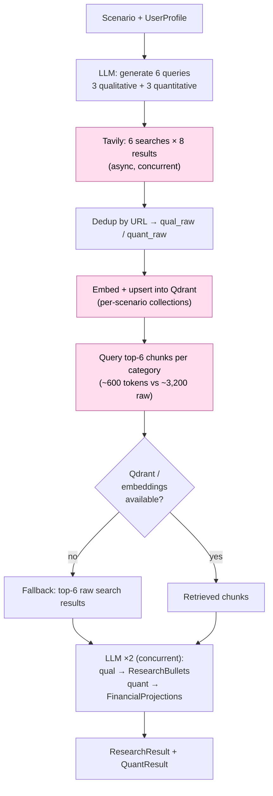

**Why the RAG step exists** (from the README's design notes): 6 queries × 8 results ≈
3,200 tokens of raw text per scenario. Storing them as embeddings and retrieving only the
top 6 most relevant chunks (~600 tokens) saves ~2,600 tokens per synthesis call — material
for both latency and cost.

**Graceful degradation** is built into every external hop: `web_search` returns `[]` when
Tavily is missing, the retriever returns `[]` when Qdrant/sentence-transformers are
unavailable (and the agent falls back to raw results), and the LLM prompts are written to
tolerate "No search results available."

---

## 8. Monte Carlo engine

Pure Python stdlib `random`, no LLM, runs in-process. For each scenario it runs
**5,000** simulations of a `time_horizon`-year income path, then reduces to percentiles
and a risk label. See [monte_carlo.py](backend/app/simulation/monte_carlo.py).

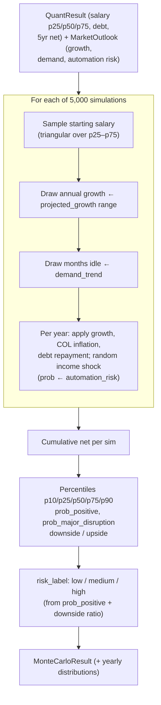

The market-outlook labels are the bridge between qualitative research and the numbers:
e.g. `automation_risk: high` raises the annual income-shock probability to 15%, and
`demand_trend: declining` widens the months-idle penalty before the first paycheck.

---

## 9. Frontend phase machine

[App.tsx](frontend/src/App.tsx) is a small state machine. Its phases are **UI states** and
are distinct from the backend's `SessionState.phase`. On mount it pings `/api/health`, then
tries to **resume** a session from `localStorage` (`second_brain_session`).

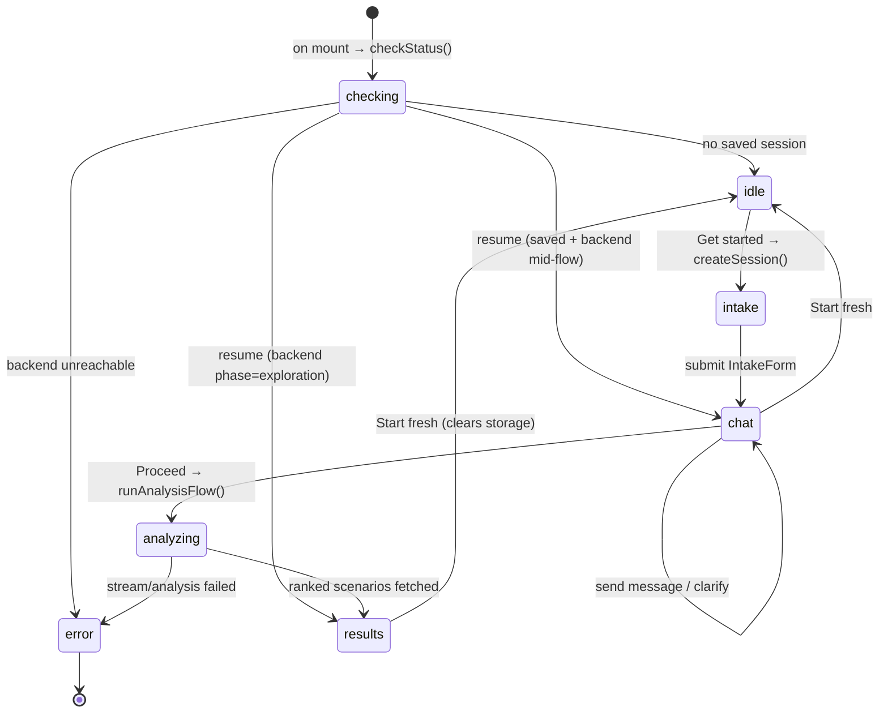

Session resume logic: if the backend reports `phase === 'exploration'`, the UI jumps
straight to **results**; otherwise it restores the saved chat transcript and returns to
**chat**. If the backend lost the session (restart cleared `sessions/`), storage is cleared
and the user lands on **idle**.

### Component status

| Component | State |
|---|---|
| `IntakeForm`, `ChatView`, `ScenarioCards` | ✅ Wired and rendered |
| `ChatPanel`, `TradeoffMatrix`, `DecisionBrief`, `WhatIfBox` | 🚧 4-line stubs (`return null`) marked "Milestone 2/4/5" |

The backend fully implements **what-if** (`/api/whatif`) and **brief** (`/api/brief`), and
[api.ts](frontend/src/api.ts) already has `submitWhatIf` / `getBrief` clients — but the UI
does not surface them yet. These are the clearest "implemented backend, pending frontend"
seams in the codebase.

---

## 10. Data model

The shared schemas live in [schemas.py](backend/app/schemas.py) and are mirrored in
[types.ts](frontend/src/types.ts). `SessionState` is the aggregate that accumulates every
agent's output through the pipeline.

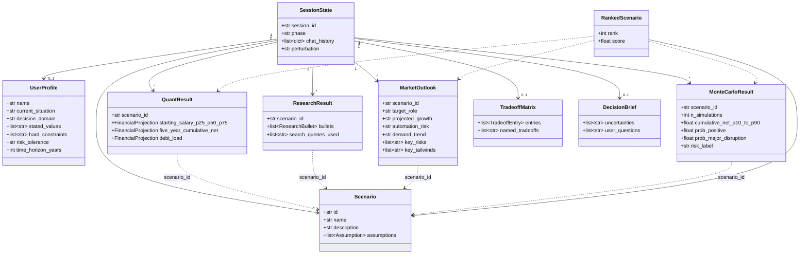

Everything keys off `scenario_id`, so `_rank_scenarios` can join the five result types back
onto each `Scenario` to build a `RankedScenario`.

---

## 11. Persistence & session lifecycle

[state.py](backend/app/state.py) defines a `MemoryStore` interface with two implementations:
`InMemoryStore` and the default `FileStore`. `FileStore` writes one JSON file per session to
`backend/sessions/{session_id}.json` on every `set()`, and the whole `SessionState` (chat
history + all results) round-trips through Pydantic. The abstract interface means Redis/SQLite
could be swapped in without touching callers.

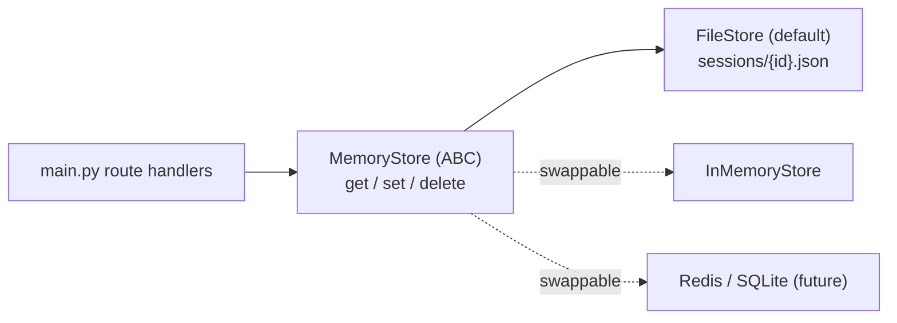

Combined with `localStorage` on the frontend, this is what makes refresh-and-resume and
backend-restart-and-resume work.

---

## 12. Resilience: every external dependency is optional

A defining property of this codebase — and why the test suite needs no keys, no Qdrant, and
no network:

| Dependency | When missing | Behavior |
|---|---|---|
| **Tavily** (`TAVILY_API_KEY` / package) | search returns `[]` | LLM synthesizes from general knowledge, flags uncertainty |
| **Qdrant** (Docker :6333) | upsert/query throw → caught | retriever returns `[]`; agent falls back to raw search results |
| **sentence-transformers** | lazy load fails | `_embeddings_available()` → `False`; retriever no-ops |
| **LLM key** | `api_key` defaults to `"ollama"` | points at an OpenAI-compatible local endpoint instead |

The embedding model is also loaded **lazily** (first analysis, not at startup) so imports and
tests stay fast and light.

---

## 13. Testing & CI

The backend ships a pytest suite that runs fully offline (see [conftest.py](backend/tests/conftest.py)):

- **[test_smoke.py](backend/tests/test_smoke.py)** — API health, session lifecycle, and endpoint
  guardrails (calling analysis/brief/what-if before prerequisites returns HTTP 400).
- **[test_simulation.py](backend/tests/test_simulation.py)** — Monte Carlo invariants: percentile
  ordering, probability bounds, risk-label thresholds, and debt/idle effects.

CI ([.github/workflows/ci.yml](.github/workflows/ci.yml)) runs two jobs on every push to `main`
and every PR:

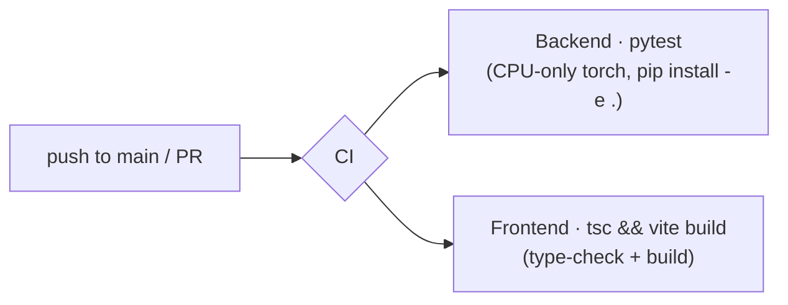

Runs on the same ref cancel superseded runs (`concurrency` + `cancel-in-progress`).

---

## 14. Tech stack reference

| Layer | Technology |
|---|---|
| Frontend | React 18 + TypeScript + Vite |
| Backend | FastAPI (Python 3.11+), Uvicorn |
| LLM | OpenAI `gpt-4o-mini` (OpenAI-compatible; Ollama-swappable) |
| Web search | Tavily |
| Vector DB | Qdrant (Docker) |
| Embeddings | `all-MiniLM-L6-v2` via sentence-transformers (384-dim, lazy) |
| Simulation | Monte Carlo, Python stdlib `random`, in-process |
| Session storage | JSON files (`backend/sessions/`) + browser `localStorage` |
| Live progress | Server-Sent Events (per-session `asyncio.Queue`) |

---

## 15. File map (the parts that matter)

```
backend/app/
├── main.py              # FastAPI routes, SSE endpoint, ranking, agent singletons
├── state.py             # SessionState + MemoryStore/FileStore persistence
├── schemas.py           # All Pydantic models (the data contract)
├── llm.py               # OpenAI client + JSON-validate/retry
├── config.py            # Settings (env-driven)
├── agents/
│   ├── base.py          # BaseAgent ABC + AgentOutput
│   ├── intake.py        # multi-turn → UserProfile
│   ├── scenario_generator.py
│   ├── research.py      # per-scenario search + Qdrant RAG + synthesis
│   ├── market_outlook.py# forward-looking labor-market assessment
│   ├── tradeoff_analyzer.py
│   ├── what_if.py
│   └── orchestrator.py  # final DecisionBrief
├── simulation/monte_carlo.py   # 5,000-run income simulation
└── tools/
    ├── web_search.py    # Tavily wrapper (degrades to [])
    ├── retriever.py     # Qdrant + embeddings (degrades to [])
    └── progress.py      # SSE per-session queue

frontend/src/
├── App.tsx              # UI phase machine + session resume
├── api.ts               # typed fetch clients
├── types.ts             # TS mirror of backend schemas
└── components/          # IntakeForm, ChatView, ScenarioCards (live); others stubbed
```

---

*Generated from a read-through of the source on the `chore/docs-tests-ci-cleanup` branch.
Diagrams are Mermaid; they render on GitHub and in most Markdown viewers.*
